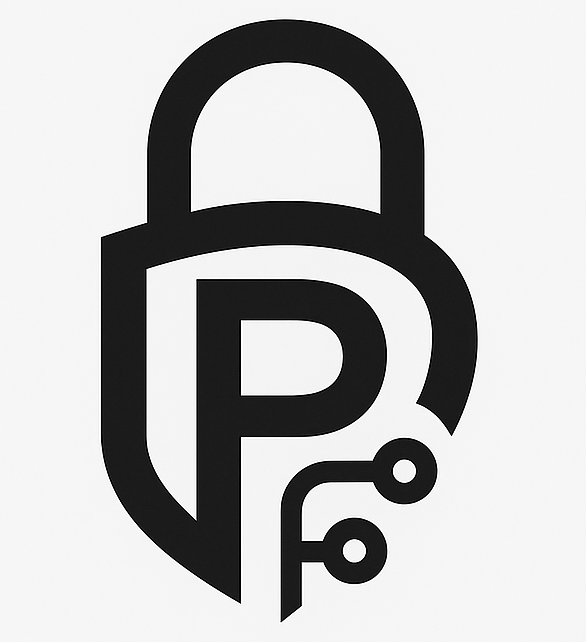

# Privment
Privment (Private Payment) is a protocol that is aimed to encrypt Solana.

## MVP 
Invoice and payment program

## Roadmap
- [x] Invoice and payments
  - [x] Creation of user account
  - [x] Creation of invoice
  - [x] Being able to pay a invoice
  - [x] Creation of receipt
- [ ] Confidential Transfer
- [ ] Invoice Encryption
- [ ] ZK compression
  - [ ] Account compression
  - [ ] Token compression

## Dependencies
- When including RSA keys
  - Perl

## Considerations
- Forward secrecy
  - Per session key
- Quantum proof
- Homomorphic encryption

# Implementation Examples
https://github.com/solana-developers/program-examples/tree/main/tokens/token-2022/nft-meta-data-pointer/anchor-example 

https://github.com/solana-developers/program-examples/tree/main/tokens/token-2022

https://github.com/deanmlittle/anchor-dice-2023/blob/master/programs/soldice-anchor/src/contexts/resolve_bet.rs 

https://github.com/deanmlittle/anchor-instruction-sysvar/blob/master/src/instructions/ed25519.rs

https://github.com/solana-program/token-2022/blob/main/zk-token-protocol-paper/part1.pdf 